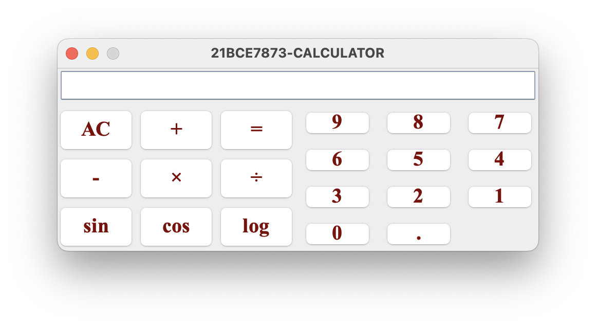

# Java Swing Calculator

This is a simple calculator GUI implemented in Java using the Swing library. It allows basic arithmetic operations and includes some additional functionalities for sine, cosine, and logarithm calculations.



## Getting Started

These instructions will help you set up the project and run the calculator GUI on your local machine.

### Prerequisites

To run this project, you need to have the following installed on your system:

- Java Development Kit (JDK) 8 or higher
- IntelliJ IDEA (or any Java IDE of your choice)

## Tech Stack


### Running the Calculator

1. Clone or download the project to your local machine.

2. Open IntelliJ IDEA and create a new Java project.

3. Copy the contents of the `Calculator.java` file into a new file in your project.

4. Create a new Java class in your project to contain the `main` method. Name it, for example, `SwingCalculator`.

5. Paste the following code into the `SwingCalculator` class:

```java
public class SwingCalculator {
    public static void main(String[] args) {
        javax.swing.SwingUtilities.invokeLater(new Runnable() {
            public void run() {
                createAndShowGUI();
            }
        });
    }

    private static void createAndShowGUI() {
        Calculator calculator = new Calculator();
        calculator.setDefaultCloseOperation(JFrame.EXIT_ON_CLOSE);
        calculator.setVisible(true);
    }
}
```
### Set up the run configuration in IntelliJ IDEA:

a. Click on "Run" in the top menu. </br>
b. Select "Edit Configurations...". </br>
c. In the left pane of the Run/Debug Configurations dialog, click on the "+" button and choose "Application" to create a new configuration. </br>
d. In the "Main class" field, enter the fully qualified name of the SwingCalculator class, which is SwingCalculator. </br>

Click "Apply" and then "OK" to save the configuration.

Now you can run the program by right-clicking on the SwingCalculator class in the Project Explorer and selecting "Run 'SwingCalculator'".

The calculator GUI will appear, and you can perform calculations using the buttons and features provided.

## Built With
Java Swing - The GUI library used to create the calculator interface.
## Authors

- [
  ](https://www.github.com/rajkanwars15)
## License
This project is licensed under the MIT License.

## Status

[](https://github.com/GIScience/badges#archive)
